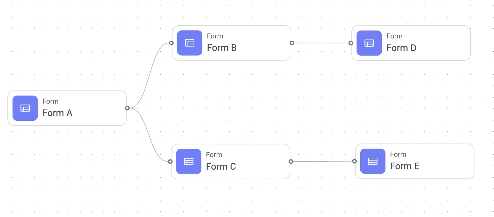
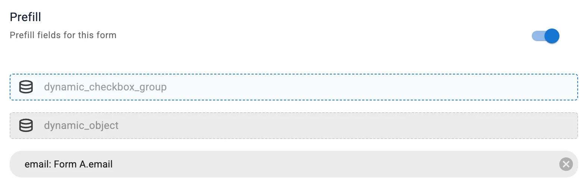
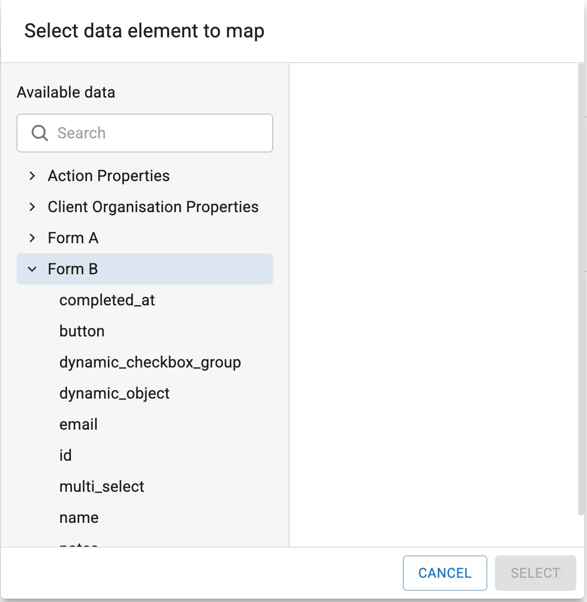

<a id="readme-top"></a>

<!-- PROJECT LOGO -->
<br />
<div align="center">
  <a href="https://github.com/tonyb650/8e204c">
    
  </a>

  <h3 align="center">Journey Builder React Coding Challenge</h3>

  <p align="center">
    A fun coding challenge to practice React skills!
  </p>
</div>


<!-- TABLE OF CONTENTS -->
<details>
  <summary>Table of Contents</summary>
  <ol>
    <li>
      <a href="#about-the-project">About The Project</a>
      <ul>
        <li><a href="#built-with">Built With</a></li>
      </ul>
    </li>
    <li>
      <a href="#getting-started">Getting Started</a>
      <ul>
        <li><a href="#prerequisites">Prerequisites</a></li>
        <li><a href="#installation">Installation</a></li>
      </ul>
    </li>
    <li><a href="#usage">Usage</a></li>
    <li><a href="#roadmap">Roadmap</a></li>
    <li><a href="#license">License</a></li>
    <li><a href="#contact">Contact</a></li>
    <li><a href="#acknowledgments">Acknowledgments</a></li>
  </ol>
</details>


<!-- ABOUT THE PROJECT -->
## About The Project
In this challenge, you will reimplement a small portion of an app. This app has a node-based UI that shows a [DAG](https://en.wikipedia.org/wiki/Directed_acyclic_graph) of forms:



When a form has been submitted, the values from the form fields can be used to prefill the fields of a downstream form. E.g., values from Form A’s fields can be used to prefill Form B’s or Form C’s fields.

First, you will use the docs to hit the `action-blueprint-graph-get` endpoint from a mock server and render a list of forms. **You do not need to render the forms as a node-based UI as in the above screenshot.**

Next, you will implement the prefill UI for Forms. **It doesn’t need to be pretty, but this UI will need to view and edit the prefill mapping.** We show this mapping when a user clicks a node and the mapping looks like this in our UI:



This shows the prefill configuration for three fields on Form D above. The first two fields are called “dynamic_checkbox_group” and “dynamic_object” and they currently have no prefilled data. The last field is called “email” and will be prefilled with the value from Form A’s email field.

Clicking the X button on the far right of the email field clears the prefill configuration for that field. Clicking a field without a configuration opens this modal:



In this modal, we see 3 types of data that can be used to prefill a form:

1. Form fields of forms that Form D directly depends on (Form B)
2. Form fields of forms that Form D transitively depends on (Form A)
3. Global data (Action Properties and Client Organization Properties)

1 and 2 will require traversing the form DAG. For 3, you can ignore Action Properties and Client Organization Properties and use whatever global data you want. 

**You should design your code so that any combination of these data sources can be easily used without code changes.** Moreover, you should design for easy support of future, new data sources.

<p align="right">(<a href="#readme-top">back to top</a>)</p>


### Built With

[![React][React.js]][React-url]\
[![Vite][Vite.dev]][Vite-url]\
[![TailwindCSS][TailwindCSS.com]][Tailwind-url]

<p align="right">(<a href="#readme-top">back to top</a>)</p>


<!-- GETTING STARTED -->
## Getting Started

To get a local copy up and running:

### Prerequisites


#### pnpm [https://pnpm.io/installation](https://pnpm.io/installation)
```sh
npm install -g pnpm@latest-10
```
  -or-
```sh
npm install -g @pnpm/exe@latest-10
```

### Installation & Startup

1. Clone the repo
   ```sh
   git clone https://github.com/tonyb650/8e204c.git
   ```
2. Ensure that the mock server is listening at port 3000. 
    ```sh
    npm start --prefix ./frontendchallengeserver 
    ```
3. Navigate to client directory
    ```sh
    cd client 
    ```
4. Install PNPM packages
   ```sh
   pnpm install
   ```
5. Start client application
   ```sh
   pnpm dev
   ```

<p align="right">(<a href="#readme-top">back to top</a>)</p>


<!-- USAGE EXAMPLES -->
## Usage

TBD...


<p align="right">(<a href="#readme-top">back to top</a>)</p>


<!-- ROADMAP -->
## Roadmap

- [ ] Clear separation of concerns
- [ ] Well-defined interfaces between components
- [ ] Thoughtful component hierarchy and composition
- [ ] **Does the project have good tests?**
- [ ] How easily new features can be added?
- [ ] Reusable and composable React components
- [ ] Document: How do I run this locally?
- [ ] Document: How do I extend with new data sources?
- [ ] Document: What patterns should I be paying attention to?
- [ ] Clean, readable code
- [ ] Reasonable, readable var names
- [ ] Appropriate use of modern React practice

TODO:
- [ ] Add tests
- [ ] Implement search in PrefillConfigModal
- [ ] Sliding switch off should clear all prefill mappings after a confirmation dialog
- [ ] Make button styling consistent across all components


Also see [open issues](https://github.com/tonyb650/8e204c/issues).

<p align="right">(<a href="#readme-top">back to top</a>)</p>


<!-- LICENSE -->
## License

Distributed under the Unlicense License. See `LICENSE.txt` for more information.

<p align="right">(<a href="#readme-top">back to top</a>)</p>


<!-- CONTACT -->
## Contact

Anthony Brierly

[![LinkedIn][linkedin-shield]][linkedin-url]

Project Link: [https://github.com/tonyb650/8e204c](https://github.com/tonyb650/8e204c)

<p align="right">(<a href="#readme-top">back to top</a>)</p>


<!-- ACKNOWLEDGMENTS -->
## Acknowledgments

Helpful resources that I used for this project:
* [HeadlessUI](https://headlessui.com)
* [Lucide Icons](https://lucide.dev)

<p align="right">(<a href="#readme-top">back to top</a>)</p>


<!-- MARKDOWN LINKS & IMAGES -->


[linkedin-shield]: https://img.shields.io/badge/-LinkedIn-black.svg?style=for-the-badge&logo=linkedin&colorB=555
[linkedin-url]: https://linkedin.com/in/tony-brierly

[React.js]: https://img.shields.io/badge/React-20232A?style=for-the-badge&logo=react&logoColor=61DAFB
[React-url]: https://reactjs.org/

[Vite.dev]: https://img.shields.io/badge/Vite-35495E?style=for-the-badge&logo=vite&logoColor=8280ff
[Vite-url]: https://vite.dev/

[TailwindCSS.com]: https://img.shields.io/badge/tailwindcss-041f30?style=for-the-badge&logo=tailwindcss&logoColor=00bcff
[Tailwind-url]: https://tailwindcss.com
